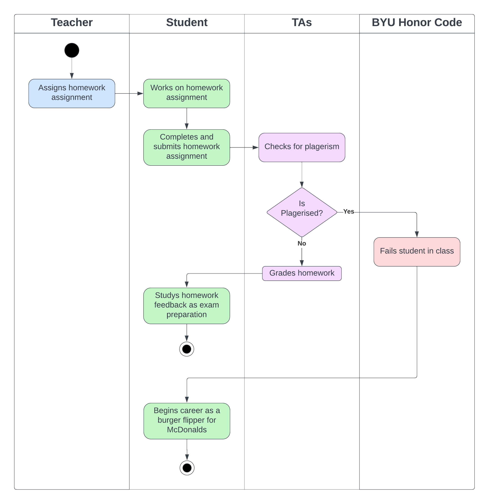
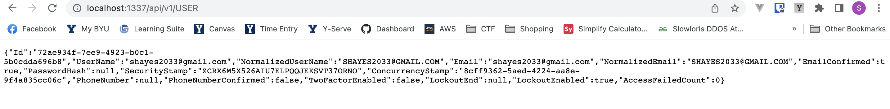
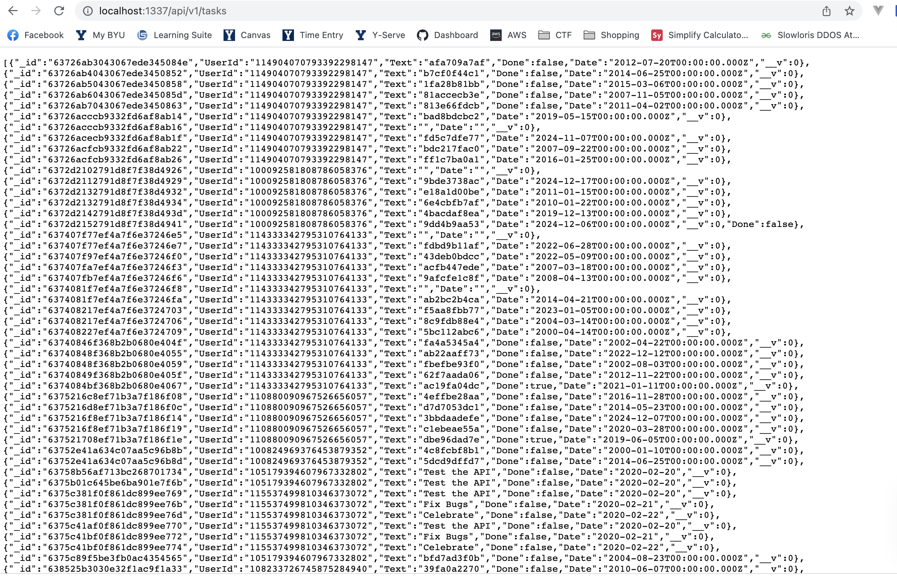
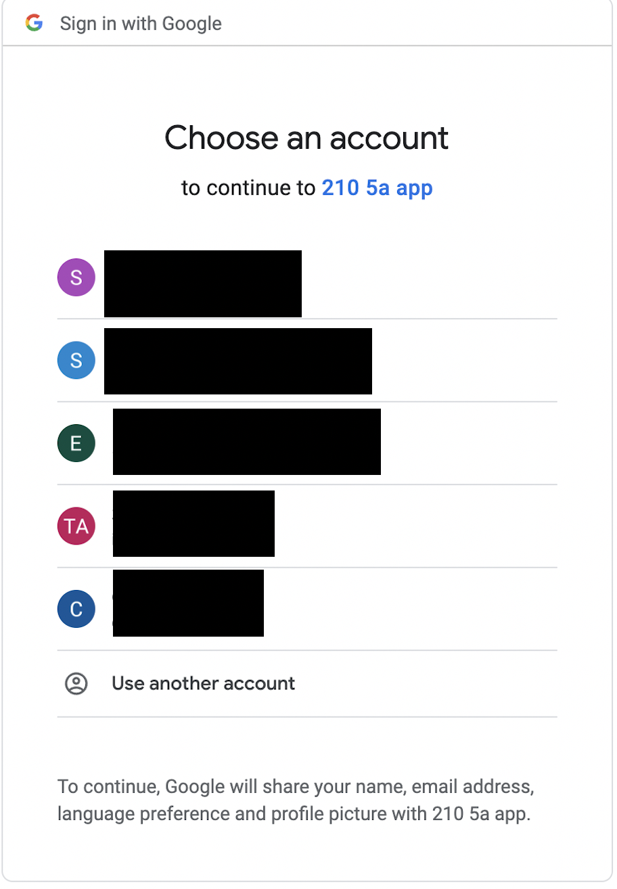

## Introduction:
John Smith  
1/20/23  
Lab 1  

## Executive Summary:
In this lab, an API was created using Node.js and then hosted on an AWS EC2 instance. The API allows an authenticated user to create, update, view, and delete tasks on a to-do list. There is also functionality for users to log in and log out using a google account.

   

## Design Overview:

### Example UML Title 

Make all of the needed UMLs are included of the correct type for the lab and each one has a title.

   

## Example Screenshots

The screenshots will normally be of the front-end design but in this case, an API has no front-end so other screenshots are acceptable

### User Endpoint

### Tasks Endpoint

### Google Login

### File Descriptions

routes/auth.js - Contains the endpoints for logging the user in and out  
routes/tasks.js - Contains all the endpoints to perform the CRUD functions for the tasks  
routes/user.js - Contains the GET endpoint to get all the user data  
models/Task.js - Contains the task model to interact with the Mongo database  
mongoose.js - Creates the connection to the Mongo database  
mssqldb.js - Creates the connection to the Azure database  
passport.js - Creates the passport session

   

## Questions (4 pts):

1. List three advantages to using a web API.
    - The front end and back end can be developed at the same time
    - Multiple front ends can use the same API back end
    - Updates can be made to the front and or back end without affecting the other one

1. What are the differences between these four HTTP methods: GET, POST, PUT, and DELETE? Which ones are idempotent?  

    GET is used to fetch data and does not have a request body. It is used only to get data and does not modify it in any way. 
    
    POST sends new data in the body of a request and does something to add new data to the API such as creating a new database record. 
    
    PUT is used to update an existing piece of information using the data in the body of the request such as changing a value from true to false of a task. 
    
    DELETE is used to indicate that data needs to be removed such as removing a task from a database because it has been completed.
    
    GET, PUT and DELETE are idempotent whereas POST is not non-idempotent

 

## Lessons Learned (4 pts):

### JavaScript Comparisons  

JavaScript does extremely loose comparisons. Therefore if (thisVar == 0) will evaluate true if thisVar = 0 or null or “” or false. This problem often arises when doing an if statement where you want to check if something is not blank but 0 is a good value. To solve this problem use === or !==. These mean an exact comparison, not a loose comparison. Therefore if (thisVar === “”) and thisVar = 0 it will be false. On the other hand if (thisVar == “”) and thisVar = 0 it will evaluate true.

There should be 3 lessons learned in your write-up, not just one.

 

## Conclusions :
- Use nodejs to create an API
- Install packages using npm
- Create an SSL certificate
- Create firewall rules to allow traffic

 

## References

https://nodejs.org/docs/latest/api/  
https://certbot.eff.org/  
https://docs.aws.amazon.com/network-firewall/latest/developerguide/rule-groups.html
